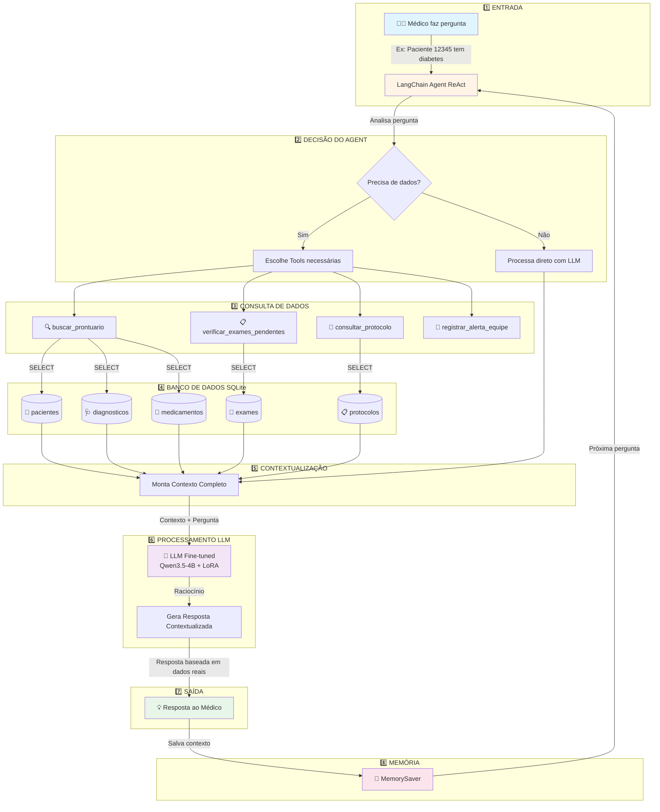
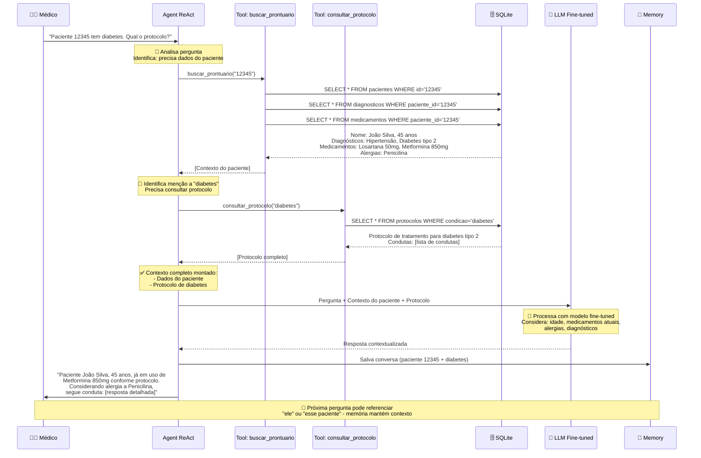

# 📊 Diagrama do Fluxo LangChain - Pipeline Completo

## 🎯 Visão Geral do Sistema



---

## 🔄 Fluxo Detalhado - Exemplo Prático

### **Pergunta:** "O paciente 12345 tem diabetes. Qual o protocolo?"



---

## 🏗️ Arquitetura em Camadas

```
┌─────────────────────────────────────────────────────────────┐
│                    INTERFACE DO USUÁRIO                      │
│  (main.py - executar_assistente)                            │
│  Input: Perguntas do médico                                 │
│  Output: Respostas contextualizadas                         │
└────────────────────┬────────────────────────────────────────┘
                     │
┌────────────────────▼────────────────────────────────────────┐
│                  CAMADA DE AGENTE                            │
│  LangChain Agent (ReAct Pattern)                            │
│  • Raciocínio: Pensa sobre o que precisa fazer             │
│  • Ação: Escolhe tools apropriadas                          │
│  • Observação: Analisa resultados das tools                 │
│  • Decisão: Repete ou finaliza                              │
└────────────────────┬────────────────────────────────────────┘
                     │
┌────────────────────▼────────────────────────────────────────┐
│                   CAMADA DE TOOLS                            │
│  4 Tools especializadas:                                    │
│  ┌──────────────────────────────────────────────────────┐  │
│  │ 🔍 buscar_prontuario(paciente_id)                    │  │
│  │    → Busca dados completos do paciente              │  │
│  ├──────────────────────────────────────────────────────┤  │
│  │ 📋 verificar_exames_pendentes(paciente_id)          │  │
│  │    → Lista exames solicitados não realizados        │  │
│  ├──────────────────────────────────────────────────────┤  │
│  │ 📖 consultar_protocolo(condicao)                     │  │
│  │    → Busca protocolos médicos do hospital           │  │
│  ├──────────────────────────────────────────────────────┤  │
│  │ 🚨 registrar_alerta_equipe(paciente_id, mensagem)   │  │
│  │    → Registra alertas para equipe médica            │  │
│  └──────────────────────────────────────────────────────┘  │
└────────────────────┬────────────────────────────────────────┘
                     │
┌────────────────────▼────────────────────────────────────────┐
│              CAMADA DE DADOS (SQLite)                        │
│  Banco de dados estruturado:                                │
│  ┌──────────────────────────────────────────────────────┐  │
│  │ 👤 pacientes          → Dados cadastrais             │  │
│  │ 🩺 diagnosticos       → Histórico de diagnósticos    │  │
│  │ 💊 medicamentos       → Medicamentos em uso          │  │
│  │ 🧪 exames             → Exames solicitados/realizados│  │
│  │ 📋 protocolos         → Protocolos institucionais    │  │
│  └──────────────────────────────────────────────────────┘  │
│  DatabaseProntuarios: Gerenciador com queries SQL          │
└────────────────────┬────────────────────────────────────────┘
                     │
┌────────────────────▼────────────────────────────────────────┐
│            CAMADA DE PROCESSAMENTO (LLM)                     │
│  Modelo Fine-tuned:                                         │
│  • Base: Qwen3.5-4B (multilingual, 4 bilhões parâmetros)   │
│  • Adapter: LoRA (Low-Rank Adaptation)                      │
│  • Dataset: MedPT (português, área materno-infantil)        │
│  • HuggingFace: emidiosouza/assistente-maternidade         │
│  • Temperature: 0.3 (respostas precisas, menos criativas)   │
└────────────────────┬────────────────────────────────────────┘
                     │
┌────────────────────▼────────────────────────────────────────┐
│                CAMADA DE MEMÓRIA                             │
│  MemorySaver (LangGraph):                                   │
│  • Mantém histórico da conversa                             │
│  • Contexto persistente entre perguntas                     │
│  • Thread ID: sessao_medica_1                               │
│  • Permite referências ("ele", "esse paciente")             │
└─────────────────────────────────────────────────────────────┘
```

---

## 🔀 Padrão ReAct (Reasoning + Acting)

O Agent usa o padrão **ReAct** para decisões inteligentes:

```
┌─────────────────────────────────────────────────────────┐
│                    CICLO ReAct                          │
└─────────────────────────────────────────────────────────┘

1️⃣ THOUGHT (Pensamento)
   ┌──────────────────────────────────────────────┐
   │ "Preciso buscar informações sobre o          │
   │  paciente 12345 antes de responder"          │
   └──────────────────────────────────────────────┘
                      ↓
2️⃣ ACTION (Ação)
   ┌──────────────────────────────────────────────┐
   │ Executa: buscar_prontuario("12345")          │
   └──────────────────────────────────────────────┘
                      ↓
3️⃣ OBSERVATION (Observação)
   ┌──────────────────────────────────────────────┐
   │ Recebe: Nome, idade, diagnósticos,           │
   │         medicamentos, alergias               │
   └──────────────────────────────────────────────┘
                      ↓
4️⃣ THOUGHT (Pensamento)
   ┌──────────────────────────────────────────────┐
   │ "Paciente tem diabetes. Preciso consultar    │
   │  o protocolo de diabetes"                    │
   └──────────────────────────────────────────────┘
                      ↓
5️⃣ ACTION (Ação)
   ┌──────────────────────────────────────────────┐
   │ Executa: consultar_protocolo("diabetes")     │
   └──────────────────────────────────────────────┘
                      ↓
6️⃣ OBSERVATION (Observação)
   ┌──────────────────────────────────────────────┐
   │ Recebe: Protocolo completo de diabetes       │
   └──────────────────────────────────────────────┘
                      ↓
7️⃣ THOUGHT (Pensamento Final)
   ┌──────────────────────────────────────────────┐
   │ "Tenho todas as informações necessárias.     │
   │  Posso gerar resposta contextualizada"       │
   └──────────────────────────────────────────────┘
                      ↓
8️⃣ FINAL ANSWER (Resposta)
   ┌──────────────────────────────────────────────┐
   │ Gera resposta considerando:                  │
   │ • Dados do paciente (idade, alergias)        │
   │ • Medicamentos atuais                        │
   │ • Protocolo institucional                    │
   └──────────────────────────────────────────────┘
```

---

## 📊 Estatísticas do Sistema

### **Componentes:**
- **1** Agent ReAct (LangChain)
- **4** Tools especializadas
- **5** Tabelas SQLite
- **1** Modelo Fine-tuned (4B parâmetros + LoRA)
- **1** Sistema de memória (MemorySaver)

### **Banco de Dados:**
- **2** pacientes de exemplo
- **3** diagnósticos associados
- **3** medicamentos em uso
- **3** exames pendentes
- **2** protocolos médicos

### **Modelo:**
- **Base:** Qwen3.5-4B (4 bilhões de parâmetros)
- **Adapter:** LoRA (~65MB)
- **Dataset:** MedPT (português médico)
- **Especialização:** Materno-infantil
- **Download:** ~2GB (primeira execução)

---

## 🔍 Exemplo Completo de Execução

### **Input:**
```
Médico: "O paciente 12345 tem diabetes. Qual o protocolo?"
```

### **Processamento Interno (Agent ReAct):**

```
[THOUGHT] Preciso buscar informações do paciente 12345
[ACTION] buscar_prontuario("12345")
[OBSERVATION]
    Nome: João Silva
    Idade: 45 anos
    Diagnósticos: Hipertensão, Diabetes tipo 2
    Medicamentos: Losartana 50mg, Metformina 850mg
    Alergias: Penicilina

[THOUGHT] Paciente já diagnosticado com diabetes tipo 2.
          Preciso consultar o protocolo de diabetes.
[ACTION] consultar_protocolo("diabetes")
[OBSERVATION]
    Protocolo: Tratamento para diabetes tipo 2
    Condutas:
    1. Monitorar glicemia capilar
    2. Solicitar HbA1c a cada 3 meses
    3. Avaliar função renal e fundo de olho anualmente
    4. Iniciar com metformina se não houver contraindicação

[THOUGHT] Tenho dados completos:
          - Paciente: João Silva, 45 anos
          - Já usa Metformina 850mg
          - Tem alergia a Penicilina
          - Também tem Hipertensão
          Posso gerar resposta contextualizada.

[FINAL ANSWER] Gerando resposta...
```

### **Output:**
```
Assistente: "Paciente João Silva, 45 anos, já em acompanhamento para
Diabetes tipo 2 com Metformina 850mg conforme protocolo institucional.

Condutas recomendadas segundo protocolo:
1. Manter monitoramento de glicemia capilar
2. Solicitar HbA1c a cada 3 meses para avaliação de controle glicêmico
3. Avaliar função renal e realizar fundoscopia anualmente
4. Metformina já em uso - avaliar resposta terapêutica e ajustar dose se necessário

Observações importantes:
- Paciente possui alergia registrada a Penicilina
- Em tratamento concomitante para Hipertensão com Losartana 50mg

Toda conduta deve ser validada pelo médico assistente com base na
avaliação clínica presencial."
```

---

## 🎯 Vantagens do Pipeline Implementado

✅ **Decisões Autônomas:** Agent escolhe quais tools usar
✅ **Dados Reais:** Consulta banco estruturado, não inventa informações
✅ **Contextualização:** Considera histórico completo do paciente
✅ **Memória:** Mantém contexto entre perguntas
✅ **Especializado:** Modelo fine-tuned em português médico
✅ **Rastreável:** Todas as decisões do Agent são logadas
✅ **Extensível:** Fácil adicionar novas tools ou tabelas

---

## 📚 Referências

- **LangChain ReAct:** https://python.langchain.com/docs/modules/agents/
- **LangGraph Memory:** https://langchain-ai.github.io/langgraph/
- **Qwen3.5 Model:** https://huggingface.co/Qwen
- **Modelo Fine-tuned:** https://huggingface.co/emidiosouza/assistente-maternidade
